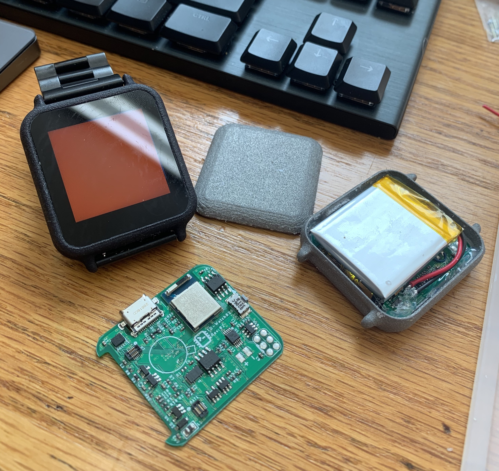

# TG-Watch02-PCB
---

## Description
Why buy an apple watch when you can spend your weekends building a microcontroller based "smart" watch instead? the TG-Watch is an open source, not-dumb watch meant for makers who want to hack on their watch or as great starting point to learn about programming.

Some of its features include:
- a 240x240, 1.54" lcd
- capacitive touchscreen
- USB Type-C port (2.0)
- Step counter and pedometer
- vibration motor and haptic motor driver
- Bluetooth 5, Bluetooth mesh, Thread, ZigBee

## Software
The TG-Watch was designed to run circuitpython, this gives anyone the flexibility to run what they can write. Additionally, there is on-going development for a python GUI framework (TG-Gui-4 and TG-Gui 5) that runs on the watch. This framework is intended to make writing UI programs to run on the fun and approachable. (Currently under going a re-write)

## Examples
Updates about software and hardware are often posted to twitter, [here](https://twitter.com/TG_Techie).

## What's on it?
- 2295018-2, USB Type-C Connector
- LSM6DSOX, accel & gyro
- DRV2605, Haptic motor driver
- NRF52840, MCU and BLE IC
- BQ27441, battery charge tracker IC
- DS3231, real time clock

## Contribution and Questions
If you have any questions feel free to reach out and start a discussion on twitter at `@TG_Techie` or on discord at `@TG-Techie#5402`.

## License

Design and copyright by Jonah Yolles-Murphy, 2020

Creative Commons Attribution/Share-Alike, all text above must be included in any redistribution. See license.txt for additional details.
